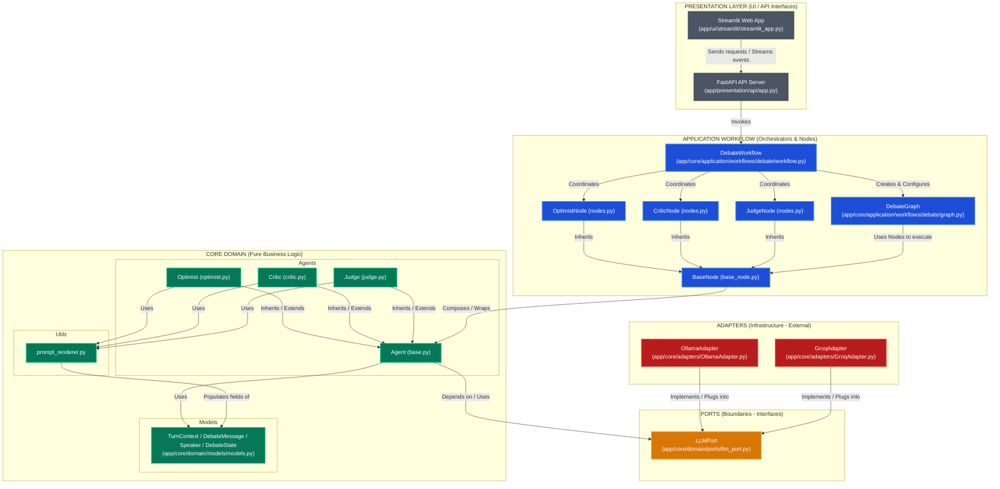
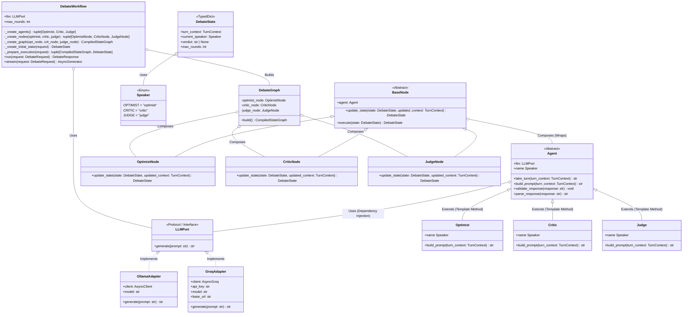
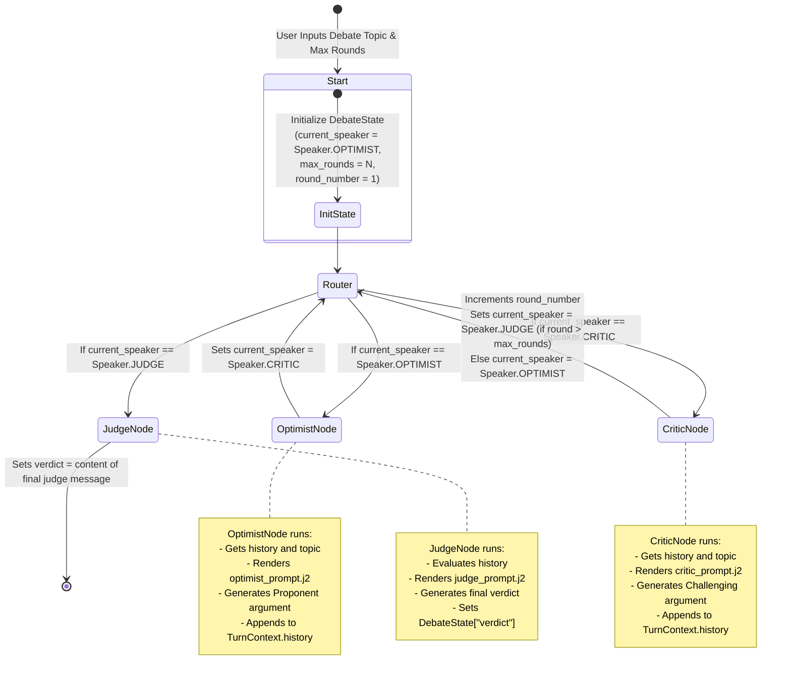

# Codebase Graph: Multi-Agent Debate System

This file is tracked inside the repository under `docs/codebase_graph.md`. You can commit this to Git and update it as the project evolves.

---

## 📂 1. Directory & File Structure

```mermaid
graph TD
    root["📁 multi-agent-debate-system/"]
    root --> app["📁 app/"]
    root --> tests["📁 tests/"]
    root --> config_files["Configuration / PRD"]

    subgraph app_folder ["app/ Core Logic & Interface"]
        app --> core["📁 core/"]
        app --> presentation["📁 presentation/"]
        app --> ui["📁 ui/"]

        core --> adapters["📁 adapters/"]
        core --> domain["📁 domain/"]
        core --> application["📁 application/"]

        adapters --> ollama_adapter["📄 OllamaAdapter.py"]
        adapters --> groq_adapter["📄 GroqAdapter.py"]

        domain --> domain_agents["📁 agents/"]
        domain --> domain_models["📁 models/"]
        domain --> domain_ports["📁 ports/"]
        domain --> domain_prompts["📁 prompts/"]
        domain --> domain_utils["📁 utils/"]

        domain_agents --> agent_base["📄 base.py"]
        domain_agents --> agent_optimist["📄 optimist.py"]
        domain_agents --> agent_critic["📄 critic.py"]
        domain_agents --> agent_judge["📄 judge.py"]

        domain_models --> model_domain["📄 models.py"]
        domain_ports --> port_llm["📄 llm_port.py"]
        domain_prompts --> template_opt["📄 optimist_prompt.j2"]
        domain_prompts --> template_crit["📄 critic_prompt.j2"]
        domain_prompts --> template_judge["📄 judge_prompt.j2"]
        domain_utils --> prompt_renderer["📄 prompt_renderer.py"]

        application --> application_dto["📁 dto/"]
        application --> application_mappers["📁 mappers/"]
        application --> app_workflows["📁 workflows/debate/"]

        application_dto --> dto_event["📄 debate_event.py"]
        application_dto --> dto_models["📄 debate_models.py"]
        application_mappers --> mapper_debate["📄 debate_mappers.py"]

        app_workflows --> workflow_base_node["📄 base_node.py"]
        app_workflows --> workflow_nodes["📄 nodes.py"]
        app_workflows --> workflow_routing["📄 routing.py"]
        app_workflows --> workflow_graph["📄 graph.py"]
        app_workflows --> workflow_main["📄 workflow.py"]
      
        presentation --> presentation_api["📁 api/"]
        presentation_api --> api_app["📄 app.py"]
        presentation_api --> api_deps["📄 dependencies.py"]
        presentation_api --> api_mappers["📁 mappers/"]
        presentation_api --> api_routers["📁 routers/"]
        presentation_api --> api_schemas["📁 schemas/"]
      
        api_mappers --> api_mapper_file["📄 api_mapper.py"]
        api_routers --> api_router_file["📄 debate.py"]
        api_schemas --> api_schema_file["📄 debate_schemas.py"]

        ui --> ui_streamlit["📁 streamlit/"]
        ui_streamlit --> streamlit_app["📄 streamlit_app.py"]
        ui_streamlit --> streamlit_client["📄 api_client.py"]
        ui_streamlit --> streamlit_components["📁 components/"]
        streamlit_components --> streamlit_comp["📄 debate_component.py"]
    end

    subgraph test_folder ["tests/ Testing Suite"]
        tests --> test_unit["📁 unit/"]
        tests --> test_integration["📁 integration/"]
        tests --> test_fakes["📁 fakes/"]
        tests --> test_builders["📁 buliders/"]
        tests --> test_conftest["📄 conftest.py"]

        test_unit --> test_agent_prompt["📄 test_agent_prompt.py"]
        test_unit --> test_unit_opt["📄 test_optimist_node.py"]
        test_unit --> test_unit_crit["📄 test_critic_node.py"]
        test_unit --> test_unit_judge["📄 test_judge_node.py"]
        test_unit --> test_unit_graph["📄 test_graph.py"]

        test_integration --> test_int_ollama["📄 test_ollama_adapter.py"]
        test_integration --> test_int_groq["📄 test_groq_adapter.py"]
        test_integration --> test_int_opt["📄 test_optimist_agent.py"]
        test_integration --> test_int_crit["📄 test_critic_agent.py"]
        test_integration --> test_int_judge["📄 test_judge_agent.py"]
        test_integration --> test_int_workflow["📄 test_workflow.py"]
        test_integration --> test_int_stream_workflow["📄 test_stream_workflow.py"]
        test_integration --> test_int_api["📁 api/"]
      
        test_int_api --> test_api_debate["📄 test_debate_api.py"]
        test_int_api --> test_api_stream["📄 test_debate_stream_api.py"]

        test_fakes --> fake_llm["📄 fake_llm.py"]
        test_builders --> builder_factory["📄 debate_state_factory.py"]
    end

    subgraph configs ["Root Files"]
        config_files --> main_py["📄 main.py"]
        config_files --> prd_md["📄 multi_agent_debate_PRD.md"]
        config_files --> readme_md["📄 README.md"]
        config_files --> pyproject_toml["📄 pyproject.toml"]
        config_files --> uv_lock["📄 uv.lock"]
    end

    %% Styles
    classDef folder fill:#1E293B,stroke:#475569,stroke-width:2px,color:#F8FAFC;
    classDef pythonFile fill:#0F172A,stroke:#38BDF8,stroke-width:1px,color:#F1F5F9;
    classDef otherFile fill:#0F172A,stroke:#94A3B8,stroke-width:1px,color:#CBD5E1;

    class root,app,tests,core,adapters,domain,application,application_dto,application_mappers,app_workflows,domain_agents,domain_models,domain_ports,domain_prompts,domain_utils,presentation,presentation_api,api_mappers,api_routers,api_schemas,ui,ui_streamlit,streamlit_components,test_unit,test_integration,test_fakes,test_builders,test_int_api folder;
    class ollama_adapter,groq_adapter,agent_base,agent_optimist,agent_critic,agent_judge,model_domain,port_llm,prompt_renderer,dto_event,dto_models,mapper_debate,workflow_base_node,workflow_nodes,workflow_routing,workflow_graph,workflow_main,api_app,api_deps,api_mapper_file,api_router_file,api_schema_file,streamlit_app,streamlit_client,streamlit_comp,test_agent_prompt,test_unit_opt,test_unit_crit,test_unit_judge,test_unit_graph,test_int_ollama,test_int_groq,test_int_opt,test_int_crit,test_int_judge,test_int_workflow,test_int_stream_workflow,test_api_debate,test_api_stream,fake_llm,builder_factory,main_py pythonFile;
    class template_opt,template_crit,template_judge,prd_md,readme_md,pyproject_toml,uv_lock otherFile;
```

---

## 🏗️ 2. Hexagonal Architecture (Ports & Adapters)

---

## 🎨 3. Low-Level Design (LLD) Class Hierarchy

---

## 🔄 4. Workflows & State Transitions (LangGraph)

